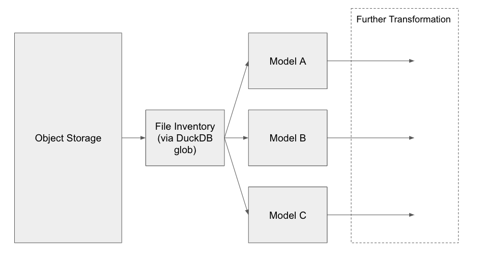

---
jupytext:
  formats: md:myst
  text_representation:
    extension: .md
    format_name: myst
    format_version: 0.13
    jupytext_version: 1.11.5
kernelspec:
  display_name: Python 3
  language: python
  name: python3
---

# 5. Handling race conditions

The models as built thus far can run into race conditions where files are added or removed from the s3 bucket during exection. We can reduce the likelihood of this type of failure by materializing our list of files. While this does not prevent deletion of files from impacting our `dbt run`, it importantly will make sure that no new files are injected into our dbt process.

The data flow will look like this:



Because we are materializing our list of files, we can be a bit more sophisticated with how we pass this file inventory into our dbt models, for example, we can now categorize our files and persist some meta-data, like modified timestamps. While typically files in object storage are treated as write once, if the file timestamp updates, we may also want to handle that as an incremental update.

```{admonition} Exercise 5.1
Build a dbt model that gets all files from an s3 path, applies some categorization, and persists the timestamp.
```